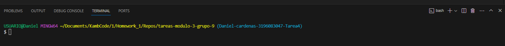

# Inicialización, Agregado y Subida de Archivos a GitHub con Git

Versionar archivos es un fundamento para el desarrollo colaborativo y gestión de proyectos, 
algunos de sus puntos clave son:

1. **Historial de cambios:** Git mantiene registro de las modificaciones realizadas, esto permite:
    * Revisión de cambios
    * Identificación de errores
    * Comprensión del proceso
2. **Colaboración efectiva:** Colaboración simultánea por parte de varios desarrolladores en diferentes 
partes del código sin dañar el trabajo de los demás.
3. **Revisión y recuperación:** Git permite revertir cambios en los archivos e incluso todo un proyecto de ser necesario, esto lo hace mediante las versiones anteriores llamadas "commits".
4. **Experimentación segura:** Mediante el uso de ramas (branches), los desarrolladores pueden probar características o realizar experimentos en el código sin temor a dañar la rama principal "main" o "master".
5. **Seguimiento de responsabilidades:** Los cambios en Git están registrados a un usuario específico. Esto quiere decir que cada cambio tiene un nombre específico, lo que permite tener transparencia sobre quién hizo qué y cuándo lo hizo.

## Iniciación de un repositorio Git

Para comenzar a versionar archivos, debemos utilizar un comando llamado ```git init``` el cual permite iniciar el proceso, esto se hace de la siguiente forma:

1. Abrir la terminal y entrar en el modo "bash"

2. Escribir el comando ```git init```
```bash
git init
```
> Esto crea un nuevo repositorio Git dentro de la carpeta seleccionada, es en este repositorio en el que se pueden crear y modificar archivos, que posteriormente estarán en Git.

## Agregar al área de preparación o staging area

Cuando se realizan modificaciones en los archivos, estas deben subirse por medio de la función commit, pero para llegar a ese punto primero se debe pasar por el área de preparación o staging area, esta permite que los cambios realizados se incluyan en el próximo commit, y se hace de la siguiente forma:

*En el modo bash de la terminal

```bash
git add .
```
> El punto va separado del add para indicar que todos los cambios que se realizaron serán subidos al staging area.

## Realizar un commit

Una vez se han agregado los cambios al staging area, estos pueden ser consolidados en un commit.
> Un commit en Git representa un punto en la historia del proyecto, este siempre lleva un mensaje descriptivo que explica los cambios realizados.

* Commit de archivos agregados 
```bash
git commit -m "Mensae descriptivo"
```

> Este texto descriptivo es **muy importante** ya que ayuda a mantener un historial claro y organizado de los cambios que tiene el código.

Por ejemplo, al hacer cambios en un archivo JS se realizaría de la siguiente forma:
```bash
git commit -m "Agrego archivo nombredelarchivo.js"
```

## Vincular un repositorio local con GitHub

Para conectar un repositorio local (está en el PC) a un repositorio en GitHub (está en internet), es necesario establecer un vínculo mediante el comando git remote add, y tener la URL del repositorio de GitHub. Esto se hace de la siguiente manera:

```bash
git remote add origin <URL_del_repositorio_de_GitHub>
```
> Se debe reemplazar "<URL_del_repositorio_de_GitHub>" por el URL real de GitHub.

* por ejemplo:
```bash
git remote add origin https://github.com/sergio-ceballos-intelex/tareas-modulo-3-grupo-10.git
```

## Subir cambios a GitHub

Para finalizar el proceso se deben subir los cambios finales a GitHub, con el comando git push, a su vez se usa la función -u origin master para declarar que la rama "master" será donde se apliquen los cambios:

```bash
git push -u origin master
```
> Esto envía los commits locales de la rama master a GitHub, el cual es el repositorio remoto, lo que permite que los demás desarrolladores puedan ver los cambios y trabajar sobre los mismos de ser necesario.


## Conclusión

En este corto tutorial se han cubierto los pasos esenciales para utilizar Git y GitHub, desde la inicialización de un repositorio hasta la subida de cambios en GitHub. Los comandos vistos son vitales para colaborar o desarrollar proyectos de software de la manera adecuada.

> Abajo algunos links que te pueden servir para ahondar más:


[Video tutorial](https://www.youtube.com/watch?v=eQMcIGVc8N0 "Como crear un Repositorio y Subir Proyecto a 👉GITHUB👈 Paso a Paso💻")

[Paso a paso](https://learn.microsoft.com/es-es/visualstudio/version-control/git-create-repository?view=vs-2022 "Paso a paso")
