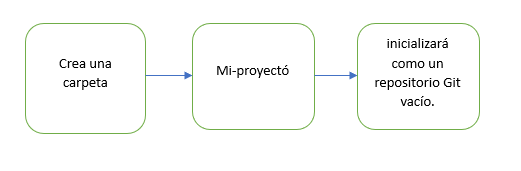

# Introducción

*Versionar archivos en un repositorio es crucial para mantener un historial claro y organizado de los cambios en tus proyectos. Git, junto con GitHub, proporciona una forma eficaz de rastrear, colaborar y revertir cambios en el código y otros archivos. En este tutorial, aprenderás cómo inicializar un repositorio, agregar archivos y subirlos a GitHub usando Git.*

1. **Inicializa el repositorio Git**

*Usa el comando git init para inicializar un repositorio Git en el directorio actual. Esto creará una carpeta oculta .git que contiene todos los archivos necesarios para el repositorio.*

     git init

2. **Agrega archivos al repositorio**

*Para agregar archivos al área de preparación (staging area), usa el comando git add. Puedes agregar un archivo específico, múltiples archivos, o todos los archivos en el directorio.*

#### Para agregar un archivo específico:

    1. git add nombre_del_archivo  
    2. git add .

3. **Realiza un commit**

*Para guardar los cambios en el repositorio, necesitas hacer un commit. Incluye un mensaje descriptivo usando la opción -m. ""*

    git commit -m "Mensaje descriptivo de los cambios"

4. **Crear un repositorio local**

* *Primero, asegúrate de tener un repositorio local.*

5. **Crear un repositorio remoto en GitHub**

* Inicia sesión en tu cuenta de GitHub.

* Ve a New seleciona y crea un repositorio

* Rellena los detalles del nuevo repositorio (nombre, descripción opcional, público o privado).

* Haz clic en el botón Create repository.

6. **Copiar la URL del repositorio remoto**

*Una vez creado el repositorio en GitHub, verás una página con algunas instrucciones para conectarlo con tu repositorio local. En la sección "Quick setup", verás una URL que se parece a algo como esto:*

* *Vincular el repositorio local con el repositorio remoto*
*Con la URL del repositorio remoto copiada, regresa a tu terminal donde tienes tu repositorio local y ejecuta el siguiente comando:*

* *git remote add origin <URL_del_repositorio_en_GitHub>*

7. Luego, sube los cambios al repositorio remoto con:
* *git push -u origin master*

## Conclusión

*Vincular tu repositorio local con un repositorio remoto en GitHub es un paso fundamental para aprovechar al máximo las capacidades de control de versiones y colaboración que ofrece Git. Aquí hay un resumen de los puntos clave que hemos cubierto:*

 1. *git init :    Inicializar el repositorio Git*

   2. *git add . :  Agregar todos los archivos al área de preparación*

   3. *git commit -m "Primer commit" :  Hacer un commit con un mensaje descriptivo*

   **Verifica el estado del repositorio**

*Puedes verificar el estado de tu repositorio en cualquier momento usando el comando git status.*

     git status

 

 

