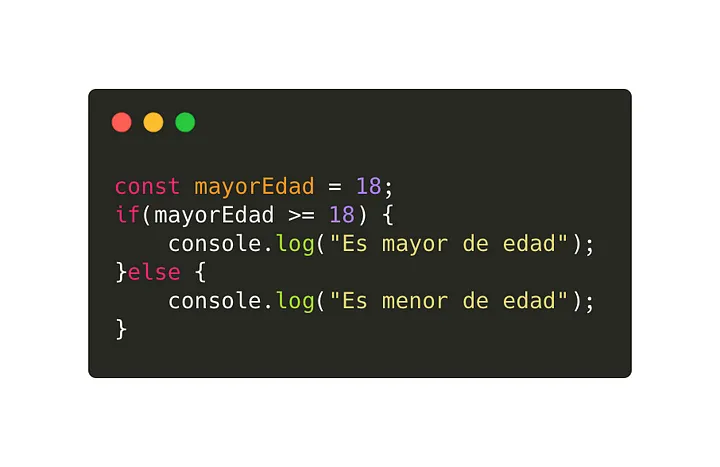
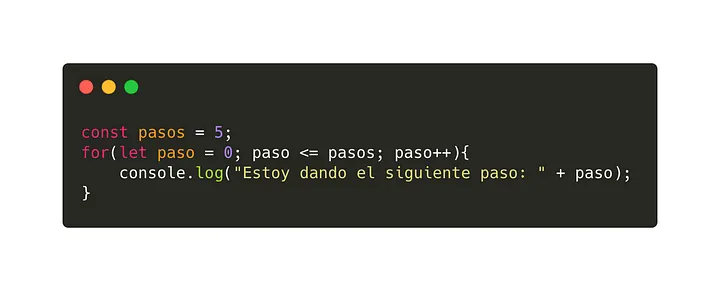
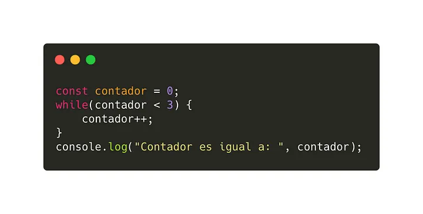
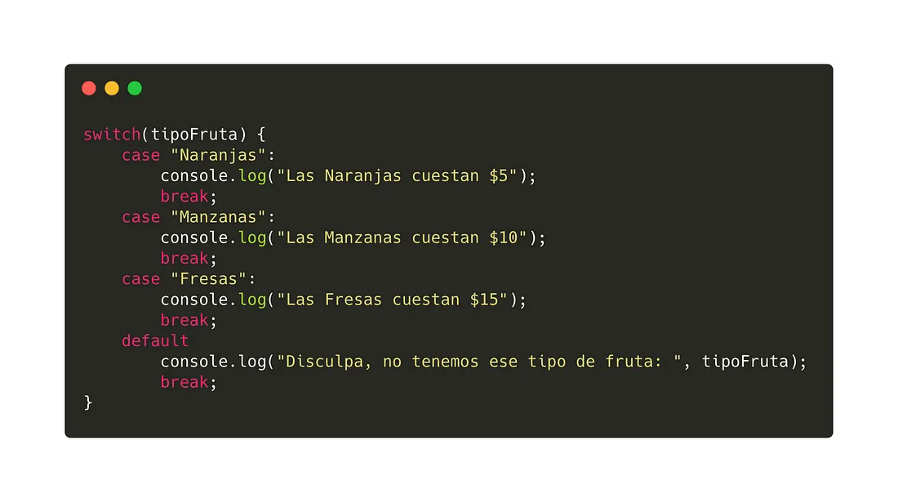

Investigación Tarea 2
Las estructuras de control y programacion son:

Secuenciales.
Esta es una estructura basica y nos permite asegurar que uuna instucción se ejecuta despues de la otra siguiendo el orden en que fueron escritas.

Selectivas.
Este tipo de structuras de control nos sirven cuando necesitamos que se evalúe el valor de alguna variable o de alguna condición para decidir que instrucciones ejecutar en caso de cumplirse la condición.

Iteractivas.
Se utilizan cuando se conoce la cantidad de ocasiones que debe repetirse in bloque de instrucciones normalmente, usan una variable de iteración o índice para controlar la cantidad de repeticiones que se han realizado.

Las estructuras de control de flujo, son intrucciones que nos permiten evaluar si se puede cumplir una condición o no, incluso nos puede ayudar a evaluarla n cantidad de veces.

Condicionales
‌Los condicionales nos permiten evaluar si una condición cumple o no con lo que estemos evaluando. Su sintaxis es muy sencilla, podemos evaluar si la condición es verdadera o falsa. Incluso añadir una condición intermedia en el caso de que no se cumpla la primera condición y se deban evaluar más.

if(condición){

}else{

}
ejemplo:

for([expresion inicial];[condición];[expresionincremento]) sentencia.
ejemplo:

while: Ejecuta una sentencia mientras la condición que se este evaluando sea verdadera.

while(condicion)
sentencia.
ejemplo:

Switch:
‌Permite evaluar una expresión e intenta igual el valor de esa expresión a una etiqueta llamada case, que es el caso a evaluar. En el caso de que la condición se cumpla o lo que tiene el case, se ejecuta la sentencia que este en ese caso.
ejemplo:
