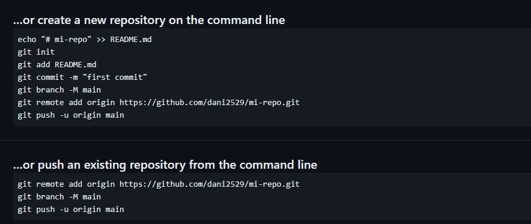

# Introducción

Versionar archivos en un repositorio es crucial para mantener un historial claro y organizado de los cambios en tus proyectos. Git, junto con GitHub, proporciona una forma eficaz de rastrear, colaborar y revertir cambios en el código y otros archivos. En este tutorial, aprenderás cómo inicializar un repositorio, agregar archivos y subirlos a GitHub usando Git.

1. *Inicializa el repositorio Git*

Usa el comando git init para inicializar un repositorio Git en el directorio actual. Esto creará una carpeta oculta .git que contiene todos los archivos necesarios para el repositorio.

     git init

2. *Agrega archivos al repositorio*

Para agregar archivos al área de preparación (staging area), usa el comando git add. Puedes agregar un archivo específico, múltiples archivos, o todos los archivos en el directorio.

#### Para agregar un archivo específico:

    1. git add nombre_del_archivo  
    2. git add .

3. *Realiza un commit*

Para guardar los cambios en el repositorio, necesitas hacer un commit. Incluye un mensaje descriptivo usando la opción -m. ""

    git commit -m "Mensaje descriptivo de los cambios"

4. *Crear un repositorio local*

* Primero, asegúrate de tener un repositorio local.

5. *Crear un repositorio remoto en GitHub*

* Inicia sesión en tu cuenta de GitHub.

* Ve a New seleciona y crea un repositorio

* Rellena los detalles del nuevo repositorio (nombre, descripción opcional, público o privado).

* Haz clic en el botón Create repository.

6. *Copiar la URL del repositorio remoto*

Una vez creado el repositorio en GitHub, verás una página con algunas instrucciones para conectarlo con tu repositorio local. En la sección "Quick setup", verás una URL que se parece a algo como esto:

* Vincular el repositorio local con el repositorio remoto
Con la URL del repositorio remoto copiada, regresa a tu terminal donde tienes tu repositorio local y ejecuta el siguiente comando:

* git remote add origin <URL_del_repositorio_en_GitHub>

7. Luego, sube los cambios al repositorio remoto con:
* git push -u origin master

## Conclusión

Vincular tu repositorio local con un repositorio remoto en GitHub es un paso fundamental para aprovechar al máximo las capacidades de control de versiones y colaboración que ofrece Git. Aquí hay un resumen de los puntos clave que hemos cubierto:

 1. git init :    Inicializar el repositorio Git

   2. git add . :  Agregar todos los archivos al área de preparación

   3. git commit -m "Primer commit" :  Hacer un commit con un mensaje descriptivo

   *Verifica el estado del repositorio*

Puedes verificar el estado de tu repositorio en cualquier momento usando el comando git status.

     git status

 

 

