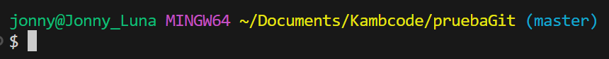
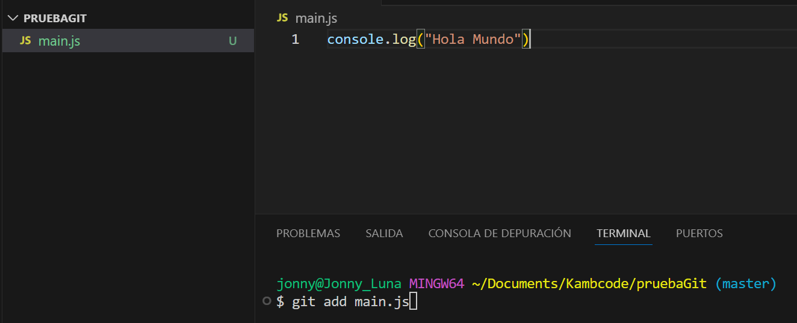
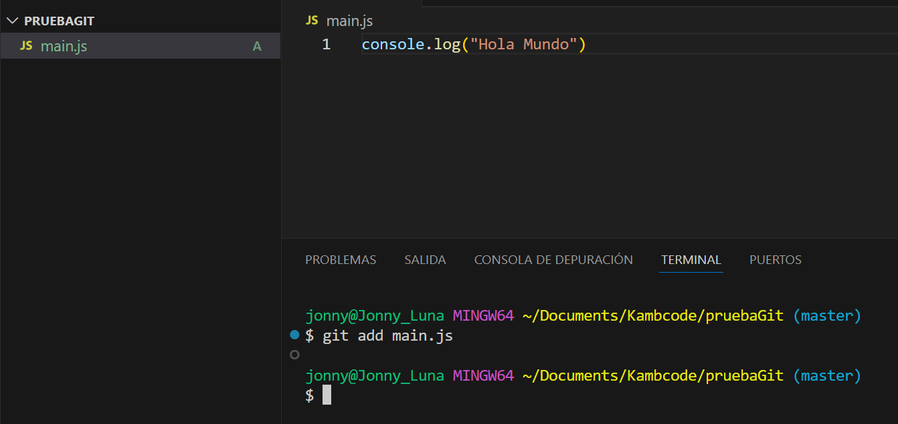
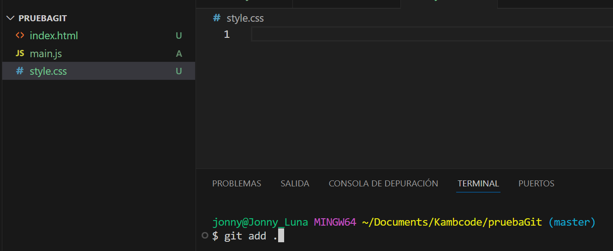
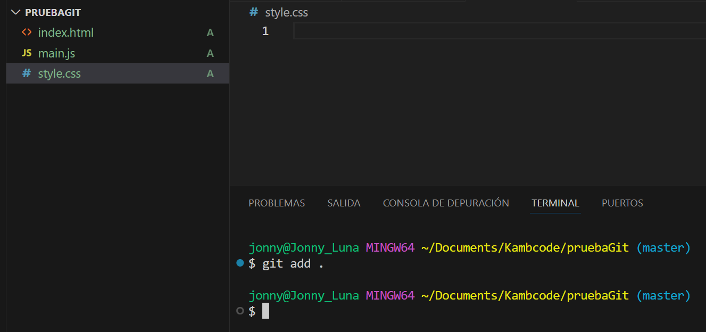
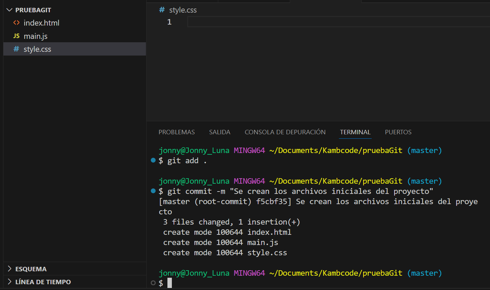
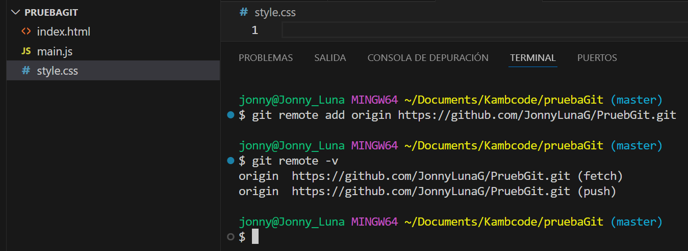
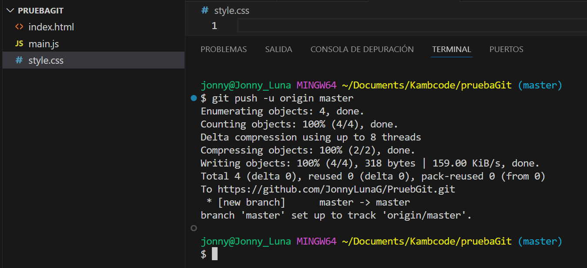
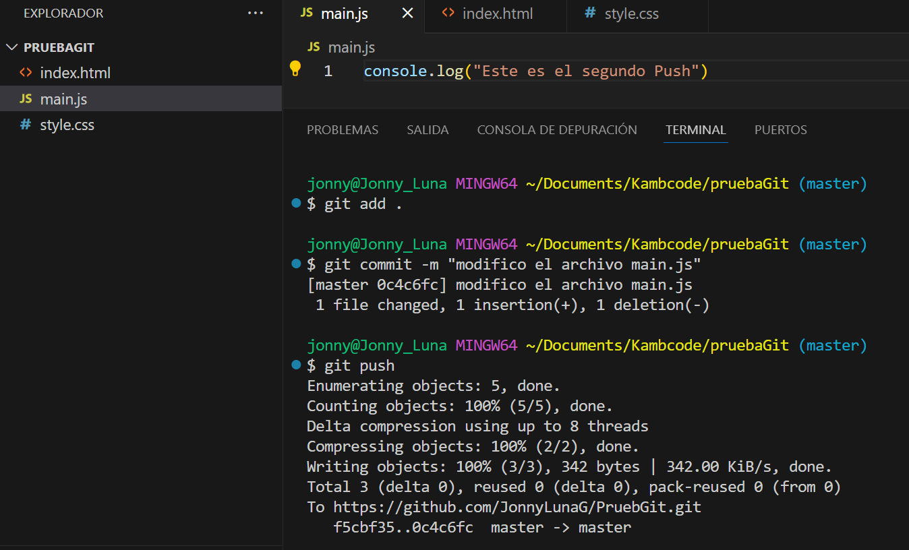

# Guia básica de Git y GitHub


## Inicialización, Agregado y Subida de Archivos a GitHub con Git

Es muy importante para el desarrollador de software o para un gestor de proyectos o simplemente para una persona que desea tener un control de versiones de un proyecto  utilizar una herramienta como Git para llevar ese control debido a que se mejora la calidad y se hace mas eficiente el o los trabajos. Se hace por ejemplo un historial en los cambios realizados en dicho proyecto, la utilidad de este hecho consiste en que se puede comparar el progreso, se puede recuperar versiones anteriores y de esta manera ver el progreso del proyecto.

Tambien es importante el repositorio ya que permite el trabajo en equipo y en diferentes dispositivos, esto potencia el trabajo colaborativo y disminuye el tiempo de ejecución del proyecto.

Es posible que cuando se trabaja en proyectos exista el riesgo de perder información o datos pero si utilizamos Github los podriamos recuperar dando esto seguridad a nuestra información.

Llevar un control de versiones de archivos en un repositorio es muy importante para tener eficiencia, colaboración, seguridad y control en el desarrollo de proyectos, logrando que cada cambio se registre de manera organizada.

## ¿cómo inicializar un repositorio Git en tu máquina local utilizando el comando git init?

Para inicializar un repositorio en la computadora después de haber instalado Git y VS Code es necesario realizar los siguientes pasos.

### Pasos:

- Crear la carpeta del proyecto en el computador.
- Abrir la carpeta del proyecto con VS Code.
- Abrir la terminal en VS Code usar Git Bash.
- Verificar en la terminal si se encuentra dentro de la carpeta del proyecto, si no esta acceder a ella.
- Utilizar el comando git init.

```bash
git init
```

- verificar la rama en la que se encuentra debe ser la rama master o main.

este debe ser el reultado, en este caso se ha creado una carpeta para el proyecto con el nombre pruebaGit. 



## ¿cómo agregar archivos al área de preparación (staging area)?

Para agregar archivos al área de trabajo se deben seguir los siguientes pasos:

### Pasos:

- Crear el archivo en el proyecto. 
- Con el siguiente comando se puede agregar un archivo al área de preparación.

```bash
git add nombreArchivo
```
 
en este ejemplo se muestra la imagen del archivo "main.js" sin agregar al área de preparación observese que aparece la letra "U" al lado del nombre del archivo indicando que aun no se ha agregado.



Resultado.



- Si son varios archivos se debe usar "git add ."



Resultado.



La imagen muestra los archivos agregados al área de preparación observese que ahora tienen la letra "A".

## ¿Cómo realizar un commit de los archivos agregados utilizando el comando git commit?

Una vez estén los archivos agregados al área de preparación, lo siguiente es hacer commit. El comando "git commit" captura el estado actual de los archivos en el área de preparación y guarda este estado en el historial del repositorio.

el comando utilizado para hacer commit es:

```bash
git commit -m "mensaje que describe lo que se hizo"
```
ejemplo.



En la figura se observa el commit a tres archivos.

## ¿Cómo vincular tu repositorio local a un repositorio remoto en GitHub?

Para trabajar con repositorios remotos y poder compartir el trabajo individual en el proyecto con otros es necesario vincular el repositorio localcon un repositorio remoto en GitHub, estos son los pasos que debes seguir.

## Pasos:

1. Crear un repositorio en GitHub:
   
   - Inicia sesión en la cuenta de GitHub.
   - Ingresa a la página principal de GitHub y haz clic en el botón "New" para crea un nuevo repositorio.
   - Rellena los campos necesarios como el nombre del repositorio y la descripción.
   - finalmente haz clic en "Create repository".

2. Copiar la URL del repositorio remoto:
    - Una vez creado el repositorio remoto, 
en GitHub mostrará las URL del repositorio.

3. Abrir la Terminal del repositorio Local.
    - Abre la terminal de tu repositorio local en VS Code.
    - Navega al directorio del proyecto local que se deseas
4. Vincular con el repositorio remoto en GitHub.
    - Asegurate de estar en la rama adecuada.
    - Utiliza el siguiente comando:

```bash
git remote add origin url_copiada
```
5. Verificar la conexión remota.

    - Se puede verificar si en efecto existe conexión con GitHub utilizando el siguiente comando en la terminal.

```bash
git remote -v
```




## ¿Cómo subir los cambios a GitHub utilizando el comando git push?

Subir cambios a GitHub utilizando el comando git push es de los pasos mas importantes en el trabajo con Git, este permite que los cambios locales se reflejen en el repositorio remoto, a continuación se muestran los pasos a seguir.

### Pasos:

- Usa el comando git push para subir los cambios al repositorio remoto. La primera vez que se haces esto, es recomendable usar la opción -u (o --set-upstream) para establecer la rama remota como el destino predeterminado para la rama local.

```bash
git push -u origin master
```
- Si no es la primera vez que se hace push se debe usar simplemente.

```bash
git push
```


En la figura anterior se muestra un ejemplo de subir los cambios a la rama master haciendo el primer push.

Este otro ejemplo muestra el caso en el que se modifica el archivo main.js y se hacen los comandos respectivos para modificar el repositorio remoto.




## Recursos bibliográficos

A continuación se encuentran recursos bibliográficos donde podrás encontrar material de estudio y complemento a esta guia de Git y GitHub.

[Documentación de Git](https://git-scm.com/doc)

[Documentación de GitHub](https://docs.github.com/es)

[Tutorial de Git y GitHub](https://youtu.be/mCVQgSyjCkI?si=u3Y13ump48Qp5pmH)

## Conclusión

En este tutorial, hemos cubierto una serie de pasos esenciales para gestionar proyectos con Git y GitHub, desde la inicialización de un repositorio local hasta la vinculación con un repositorio remoto y la subida de cambios. Aquí tienes un resumen de los puntos clave:

```bash
# Crear y navegar al directorio del proyecto
mkdir mi_proyecto
cd mi_proyecto

# Inicializar el repositorio Git
git init

# Crear un archivo y añadir contenido
echo 'console.log("Hola, mundo!");' > script.js

# Agregar el archivo al área de preparación
git add script.js

# Confirmar los cambios
git commit -m "Añadir script.js con un mensaje de consola"

# Vincular con el repositorio remoto
git remote add origin https://github.com/tu-usuario/mi_proyecto.git

# Subir los cambios al repositorio remoto
git push -u origin main
```